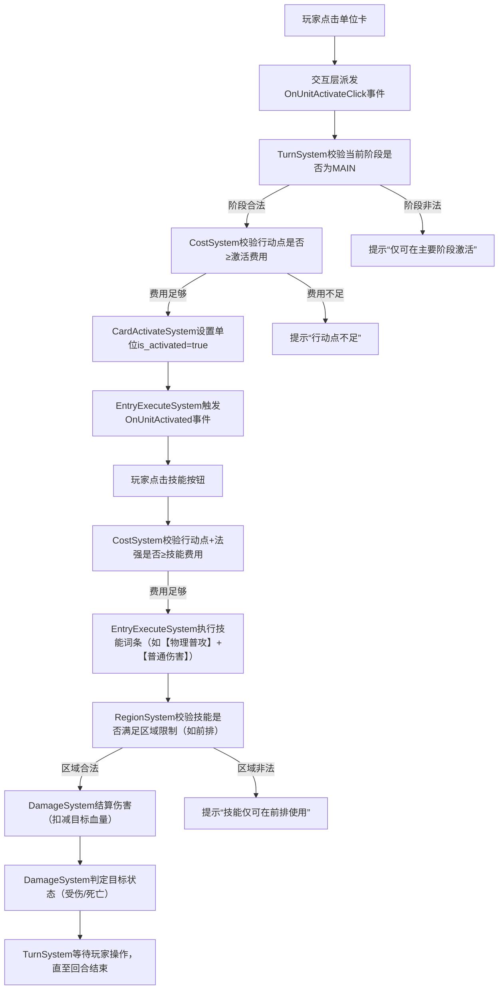

### 一、回合制卡牌游戏卡牌效果/词条执行系统的标准实现方式

回合制卡牌游戏的效果/词条执行系统核心是**模块化、可配置、时序可控**，行业内标准实现方式主要包含以下核心设计：

#### 1. 核心设计模式

- **命令模式（Command Pattern）**：将每个卡牌效果/词条封装为独立的`Command`对象（如`PhysicalAttackCommand`、`MagicSkillCommand`），每个命令包含「执行条件、执行逻辑、回滚逻辑」，支持效果的复用、撤销和组合。
- **事件驱动（Event-Driven）**：通过事件总线（EventBus）触发效果执行（如`OnUnitActivated`、`OnTurnEnd`、`OnDamageDealt`），效果/词条订阅对应事件，满足条件时自动执行，解耦触发源与执行逻辑。
- **规则引擎（Rule Engine）**：抽离核心规则（如费用校验、区域限制、冷却判定）为独立规则库，效果执行前先通过规则引擎校验合法性（如“是否满足前排使用”“行动点是否足够”）。
- **时序管理器（Timing Manager）**：管理效果执行的优先级（如“特殊说明＞后发动效果＞先发动效果”）和阶段（如回合开始/主要/结束阶段），确保多效果叠加时按规则书要求的顺序执行。

#### 2. 词条/效果的核心实现逻辑

- **词条模块化**：将词条拆分为最小粒度的可复用单元，技能由多个词条组合而成（如“【物理普攻：1】+【治疗：1】”）。
- **条件-动作（Condition-Action）模型**：每个效果/词条包含「触发条件（Condition）+ 执行动作（Action）」，条件支持组合逻辑（AND/OR/NOT），动作支持链式执行。
- **状态机管理执行状态**：为效果执行过程设计状态机（如“待触发→校验条件→执行→结算→结束”），处理中途中断（如效果被抵消）、异常（如目标退场）等场景。

#### 3. 适配你规则书的特殊机制

结合你的规则（如冷却状态、法强判定、区域限制），需额外实现：

- 位移后冷却的“状态标记+阶段校验”；
- 法强值实时计算（圣物能量+已激活单位法力）的“依赖监听”；
- 敌方意图池的“概率随机+条件重检”逻辑；
- 魔法技能的“法强＞敌方法强”前置校验。

### 二、卡牌系统的数据结构设计（支持复杂效果/词条）

数据结构需满足**可序列化、可扩展、低耦合**，建议采用「配置化+运行时状态分离」的设计，核心结构如下（以Godot支持的GDScript/JSON为例）：

#### 1. 核心数据结构分层

| 层级          | 数据结构（GDScript/JSON）   | 说明                                  |
| ----------- | --------------------- | ----------------------------------- |
| 基础配置层（静态）   | 卡牌配置表（JSON/CSV）       | 存储卡牌固定属性，不随游戏运行变化，可热更               |
| 运行时状态层（动态）  | 实体状态类（GDScript Class） | 存储卡牌/单位的实时状态（如血量、激活状态、冷却、位置）        |
| 效果/词条层（可组合） | 词条配置+执行上下文            | 存储词条的触发条件、执行逻辑、参数，以及执行时的上下文（目标、费用等） |

#### 2. 关键数据结构示例（GDScript）

```gdscript
# 1. 卡牌基础配置（JSON/CSV序列化，加载到内存后映射为该类）
class CardConfig:
    var card_id: String  # 唯一标识
    var card_type: String  # 单位卡/策略卡/敌方卡
    var base_attr: Dictionary  # 基础属性
        # 单位卡：{"hp": 10, "mana": 3, "activate_cost": 3, "skill_cost": {"action": 2, "magic_power": 1}}
        # 策略卡：{"type": "tactics/magic", "trigger_type": "active/passive", "cost": {"action": 1, "magic_power": 0}}
        # 敌方卡：{"level": 2, "hp": 15, "magic_power": 4, "hate_target": "player_unit/st圣物"}
    var entry_list: Array[EntryConfig]  # 词条列表
    var constraints: Dictionary  # 约束：{"region": "front/back/all", "timing": "main_phase/turn_end", "cool_down_after_move": true}

# 2. 词条配置（最小粒度可复用单元）
class EntryConfig:
    var entry_id: String  # 词条唯一标识（如"physical_attack"、"cool_down_after_move"）
    var trigger_condition: Dictionary  # 触发条件：{"event": "on_activate", "conditions": [{"type": "region", "value": "front"}, {"type": "action_point", "value": ">0"}]}
    var actions: Array[ActionConfig]  # 执行动作列表
    var priority: int = 0  # 执行优先级（数值越高越先执行）
    var is_overwrite: bool = false  # 是否覆盖同类型先发动效果

# 3. 动作配置（词条的具体执行逻辑）
class ActionConfig:
    var action_type: String  # 动作类型（如"damage"、"change_mp"、"add_buff"、"move_unit"）
    var params: Dictionary  # 动作参数：{"damage_type": "physical/special", "value": 5, "target": "enemy_front"}
    var cost: Dictionary  # 动作消耗：{"action_point": 2, "magic_power": 1}

# 4. 运行时卡牌状态（绑定到ECS实体）
class CardRuntimeState:
    var card_config: CardConfig  # 关联静态配置
    var current_hp: int  # 当前血量
    var is_activated: bool = false  # 是否激活（单位卡）
    var is_in_cool_down: bool = false  # 是否冷却
    var current_region: String = "back"  # 当前区域（front/back）
    var buffs: Array[BuffState]  # 增益/减益状态
    var remaining_action_point: int = 4  # 剩余行动点（全局/单位）
    var sacred_relic_energy: int = 10  # 圣物能量（全局）
```

#### 3. 数据结构扩展原则

- 静态配置与运行时状态分离：静态配置（如卡牌基础属性、词条）用JSON/CSV存储，方便策划修改；运行时状态（如血量、冷却）在游戏内动态维护。
- 词条/动作支持“组合+继承”：比如【特殊物理攻击】=【物理攻击】+【特殊伤害】，通过继承基础词条减少重复配置。
- 支持条件扩展：新增条件（如“圣物能量＞5”）时，仅需新增条件校验函数，无需修改核心数据结构。

### 三、卡牌系统逻辑层架构（高灵活性+可扩展性）

采用**分层架构+事件总线+依赖注入**，核心目标是“规则与表现分离、逻辑与数据分离”，架构分层如下（从底层到上层）：

| 层级  | 核心职责                                         | 技术实现（Godot）                   | 扩展性设计            |
| --- | -------------------------------------------- | ----------------------------- | ---------------- |
| 数据层 | 管理静态配置（JSON加载）、运行时状态（ECS组件）、存档/读档            | GDScript Class + JSONParser   | 配置热更、状态序列化/反序列化  |
| 规则层 | 封装核心规则（费用校验、区域限制、法强计算、胜负判定）                  | 纯逻辑Class（无Godot节点）            | 规则模块化，新增规则仅需加类   |
| 事件层 | 事件总线（EventBus），派发/订阅游戏事件（如`OnUnitActivated`） | 单例EventBus Class              | 新增事件仅需定义事件名，无耦合  |
| 执行层 | 执行卡牌效果/词条、管理时序、处理效果冲突                        | Command + 时序管理器               | 新增效果仅需封装Command  |
| 交互层 | 处理玩家输入（点击卡牌、位移、激活）、AI决策（敌方意图池）               | Godot Input + AI状态机           | 输入/AI逻辑分离，易替换    |
| 表现层 | 卡牌UI、特效、音效、动画（与逻辑层解耦）                        | Godot Control/AnimationPlayer | 表现逻辑通过事件驱动，不影响核心 |

#### 核心设计原则

1. **低耦合**：各层通过事件总线通信，而非直接调用（如“玩家点击激活单位”→交互层派发`OnUnitActivateClick`→执行层订阅并触发激活逻辑）。
2. **可替换**：比如AI逻辑（敌方意图池）可独立替换，无需修改核心执行层；表现层可替换UI风格，不影响规则。
3. **可测试**：规则层纯逻辑无Godot节点依赖，可单独编写单元测试（如校验“法强计算是否正确”“冷却状态是否生效”）。

### 四、基于ECS架构的卡牌系统完整方案（适配Godot+你的规则书）

ECS（实体-组件-系统）的核心是：**Entity（实体）承载组件、Component（组件）仅存数据、System（系统）处理逻辑**，完全契合卡牌游戏“多实体（卡牌/单位/圣物）、多状态（组件）、多规则（系统）”的特点。

#### 1. 适配Godot的ECS架构选型

Godot原生无内置ECS框架，推荐两种实现方式（新手优先选方式1）：

- **方式1（轻量适配）**：以`Node`作为`Entity`（实体），`Node`的子节点/自定义Class作为`Component`（仅存数据），`Autoload`单例作为`System`（处理逻辑）。
- **方式2（纯ECS）**：使用Godot ECS插件（如`godot-ecs`），实体为无状态ID，组件为纯数据结构，系统为逻辑处理器。

以下方案基于**方式1（新手友好）** 设计，完全适配你的规则书。

#### 2. 核心实体（Entity）设计

实体是游戏内所有可交互对象的载体，每个实体绑定唯一ID和若干组件，核心实体如下：

| 实体类型              | 对应Godot节点类型     | 核心职责            | 关联规则书机制           |
| ----------------- | --------------- | --------------- | ----------------- |
| CardEntity        | Node2D          | 卡牌（单位卡/策略卡/敌方卡） | 激活、技能、费用、词条       |
| UnitEntity        | CharacterBody2D | 部署后的单位（玩家/敌方）   | 位移、冷却、受伤/死亡、区域限制  |
| SacredRelicEntity | Node2D          | 圣物              | 能量值、失败判定          |
| RegionEntity      | Area2D          | 作战区域（前排/后排/敌方区） | 部署上限、区域限制         |
| TurnEntity        | Node            | 回合管理            | 回合阶段、行动点重置、敌方意图触发 |

#### 3. 核心组件（Component）设计（仅存数据，无逻辑）

组件是实体的“属性模块”，每个组件对应一类数据，需继承`Node`（Godot），核心组件如下：

| 组件名                  | 所属实体            | 核心数据（示例）                                                                  | 关联规则书机制           |
| -------------------- | --------------- | ------------------------------------------------------------------------- | ----------------- |
| BaseAttrComponent    | Card/Unit/Enemy | id: String, hp: int, mana: int                                            | 单位卡基础属性、敌方血量/法强   |
| CostComponent        | Card/Unit       | activate\_cost: int, skill\_cost: Dictionary{"action": int, "magic": int} | 激活费用、技能费用（行动点+法强） |
| StateComponent       | Unit/Card       | is\_activated: bool, is\_cool\_down: bool, is\_hurt: bool                 | 激活状态、冷却、受伤状态      |
| RegionComponent      | Unit/Region     | current\_region: String, max\_deploy: int                                 | 前排/后排、部署上限        |
| EntryComponent       | Card/Unit       | entry\_list: Array\[EntryConfig], trigger\_events: Array\[String]         | 词条列表、触发事件         |
| SacredRelicComponent | SacredRelic     | energy: int, is\_dead: bool                                               | 圣物能量、失败判定         |
| EnemyAIComponent     | Enemy           | intent\_pool: Array\[IntentConfig], hate\_target: String, priority: int   | 敌方意图池、仇恨目标、行动优先级  |
| TurnComponent        | Turn            | current\_phase: String, action\_point: int, magic\_power: int             | 回合阶段、行动点、法强值      |

**组件示例代码（GDScript）**：

```gdscript
# BaseAttrComponent.gd（继承Node）
extends Node
class_name BaseAttrComponent

# 基础属性
var card_id: String = ""
var card_type: String = ""  # "unit"/"strategy"/"enemy"
var hp: int = 0
var mana: int = 0  # 法力值（单位卡）
var magic_power: int = 0  # 法强（敌方/法术）

# 初始化
func init(config: Dictionary):
    card_id = config.card_id
    card_type = config.card_type
    hp = config.hp
    mana = config.mana if config.has("mana") else 0
    magic_power = config.magic_power if config.has("magic_power") else 0
```

#### 4. 核心系统（System）设计（仅处理逻辑，无数据）

系统是ECS的“逻辑核心”，通过`Autoload`注册为全局单例，监听事件并处理实体的组件数据，核心系统如下：

| 系统名                | 核心职责               | 核心逻辑（适配规则书）                                                             |
| ------------------ | ------------------ | ----------------------------------------------------------------------- |
| TurnSystem         | 回合流程管理（开始/主要/结束阶段） | 1. 回合开始：重置行动点、计算法强；2. 主要阶段：处理玩家操作；3. 回合结束：结算持续效果、触发敌方前置准备               |
| CostSystem         | 费用校验与扣减（行动点/法强）    | 1. 校验激活/技能费用是否足够；2. 扣减行动点/法强；3. 被动策略卡费用预留校验                             |
| CardActivateSystem | 单位卡激活逻辑            | 1. 校验激活条件（区域、费用）；2. 设置`is_activated=true`；3. 触发“激活成功”事件                 |
| EntryExecuteSystem | 词条/效果执行            | 1. 监听事件（如`OnUnitActivated`）；2. 校验词条触发条件；3. 按优先级执行词条动作；4. 处理效果冲突（后发覆盖先发） |
| RegionSystem       | 区域管理与位移逻辑          | 1. 校验部署上限；2. 处理位移操作；3. 位移后设置`is_cool_down=true`；4. 校验技能区域限制             |
| DamageSystem       | 伤害结算（普通/特殊伤害）      | 1. 区分物理/魔法、普通/特殊伤害；2. 受伤状态（血量=1）强制退场；3. 死亡判定（血量=0）入墓地                   |
| EnemyAISystem      | 敌方意图执行             | 1. 从意图池随机选意图；2. 校验触发条件；3. 执行意图（攻击/召唤/防御）；4. 冷却技能类意图                     |
| SacredRelicSystem  | 圣物能量管理与胜负判定        | 1. 实时更新圣物能量；2. 能量=0时判定失败；3. 敌方全灭时判定胜利                                   |

**系统示例代码（TurnSystem.gd，Autoload单例）**：

```gdscript
extends Node
class_name TurnSystem

# 回合阶段枚举
enum TurnPhase { START, MAIN, END, ENEMY_TURN }
var current_phase: TurnPhase = TurnPhase.START
var player_action_point: int = 4  # 初始行动点上限
var sacred_relic_energy: int = 10  # 圣物初始能量

# 依赖的系统（通过Autoload获取）
@onready var cost_sys: CostSystem = get_node("/root/CostSystem")
@onready var entry_sys: EntryExecuteSystem = get_node("/root/EntryExecuteSystem")

# 开始新回合
func start_new_turn():
    # 1. 回合开始阶段
    current_phase = TurnPhase.START
    reset_action_point()  # 重置行动点
    calculate_magic_power()  # 计算法强
    entry_sys.trigger_event("OnTurnStart")  # 触发“回合开始”事件（词条/效果）
    
    # 2. 进入主要阶段
    current_phase = TurnPhase.MAIN
    entry_sys.trigger_event("OnMainPhaseStart")

# 重置行动点到上限
func reset_action_point():
    player_action_point = 4  # 初始上限，可通过增益修改
    entry_sys.trigger_event("OnActionPointReset")

# 计算法强（法强=圣物剩余能量+已激活单位法力总和）
func calculate_magic_power() -> int:
    var activated_units: Array[UnitEntity] = get_activated_units()  # 获取所有已激活单位
    var unit_mana_sum: int = 0
    for unit in activated_units:
        var base_attr = unit.get_node("BaseAttrComponent") as BaseAttrComponent
        unit_mana_sum += base_attr.mana
    var total_magic_power = sacred_relic_energy + unit_mana_sum
    entry_sys.trigger_event("OnMagicPowerCalculated", {"value": total_magic_power})
    return total_magic_power

# 结束玩家回合
func end_player_turn():
    current_phase = TurnPhase.END
    # 1. 结算持续效果、被动策略卡
    entry_sys.trigger_event("OnTurnEnd")
    # 2. 敌方回合前置准备
    entry_sys.trigger_event("OnEnemyTurnPrepare")
    # 3. 进入敌方回合
    current_phase = TurnPhase.ENEMY_TURN
    get_node("/root/EnemyAISystem").execute_enemy_intent()

# 获取所有已激活单位（示例）
func get_activated_units() -> Array[UnitEntity]:
    var units: Array[UnitEntity] = []
    var unit_nodes = get_tree().get_nodes_in_group("player_units")
    for node in unit_nodes:
        var state_comp = node.get_node("StateComponent") as StateComponent
        if state_comp.is_activated:
            units.append(node)
    return units
```

#### 5. 核心交互流程（基于ECS的完整执行链路）

以“玩家激活单位卡并使用技能”为例，完整流程如下：



#### 6. Godot中实施的关键步骤

##### 步骤1：搭建ECS基础结构

- 创建`Component`基类（所有组件继承）：
  ```gdscript
  # Component.gd
  extends Node
  class_name Component

  var entity: Node  # 绑定的实体
  func bind_entity(target_entity: Node):
      entity = target_entity
  ```
- 将核心系统（`TurnSystem`/`CostSystem`等）注册为`Autoload`（Godot菜单：Project→Project Settings→Autoload），确保全局可访问。

##### 步骤2：配置卡牌数据

- 编写JSON配置文件（如`card_config.json`），示例：
  ```json
  [
      {
          "card_id": "unit_001",
          "card_type": "unit",
          "hp": 5,
          "mana": 2,
          "activate_cost": 2,
          "skill_cost": {"action": 1, "magic": 2},
          "constraints": {"region": "front", "cool_down_after_move": true},
          "entry_list": [
              {
                  "entry_id": "physical_attack",
                  "trigger_condition": {"event": "on_skill_use", "conditions": [{"type": "region", "value": "front"}]},
                  "actions": [{"action_type": "damage", "params": {"damage_type": "physical", "value": 3}, "cost": {"action": 1, "magic": 2}}],
                  "priority": 1,
                  "is_overwrite": false
              }
          ]
      }
  ]
  ```
- 编写配置加载器（`ConfigLoader.gd`），将JSON解析为`CardConfig`对象：
  ```gdscript
  # ConfigLoader.gd
  extends Node
  class_name ConfigLoader

  func load_card_config() -> Dictionary:
      var file = File.new()
      file.open("res://config/card_config.json", File.READ)
      var json_str = file.get_as_text()
      file.close()
      var json = JSON.parse_string(json_str)
      var card_config_map: Dictionary = {}
      for card_data in json:
          var config = CardConfig.new()
          config.card_id = card_data.card_id
          config.card_type = card_data.card_type
          # 填充其他属性...
          card_config_map[config.card_id] = config
      return card_config_map
  ```

##### 步骤3：实体与组件绑定

- 创建`UnitEntity`节点（继承`CharacterBody2D`），添加所需组件（`BaseAttrComponent`/`StateComponent`等）：
  ```gdscript
  # UnitEntity.gd
  extends CharacterBody2D
  class_name UnitEntity

  @onready var base_attr_comp: BaseAttrComponent = $BaseAttrComponent
  @onready var state_comp: StateComponent = $StateComponent
  @onready var cost_comp: CostComponent = $CostComponent

  # 初始化实体
  func init(card_config: CardConfig):
      base_attr_comp.init({"card_id": card_config.card_id, "card_type": card_config.card_type, "hp": card_config.base_attr.hp, "mana": card_config.base_attr.mana})
      cost_comp.init({"activate_cost": card_config.base_attr.activate_cost, "skill_cost": card_config.base_attr.skill_cost})
      state_comp.init({"is_activated": false, "is_cool_down": false})
      # 绑定组件到实体
      base_attr_comp.bind_entity(self)
      state_comp.bind_entity(self)
      cost_comp.bind_entity(self)
  ```

##### 步骤4：事件总线实现

- 创建`EventBus`单例（Autoload），处理事件派发/订阅：
  ```gdscript
  # EventBus.gd
  extends Node
  class_name EventBus

  var listeners: Dictionary = {}  # key: 事件名, value: 订阅者列表（函数）

  # 订阅事件
  func subscribe(event_name: String, callback: Callable):
      if not listeners.has(event_name):
          listeners[event_name] = []
      listeners[event_name].append(callback)

  # 派发事件
  func emit(event_name: String, data: Dictionary = {}):
      if listeners.has(event_name):
          for callback in listeners[event_name]:
              callback.call_deferred(data)  # 延迟调用，避免帧内阻塞
  ```

##### 步骤5：系统绑定事件

- 在`EntryExecuteSystem`中订阅事件并执行词条：
  ```gdscript
  # EntryExecuteSystem.gd
  extends Node
  class_name EntryExecuteSystem

  @onready var event_bus: EventBus = get_node("/root/EventBus")
  @onready var damage_sys: DamageSystem = get_node("/root/DamageSystem")

  func _ready():
      # 订阅“单位激活”事件
      event_bus.subscribe("OnUnitActivated", Callable(self, "_on_unit_activated"))
      # 订阅“技能使用”事件
      event_bus.subscribe("OnSkillUse", Callable(self, "_on_skill_use"))

  func _on_unit_activated(data: Dictionary):
      var unit: UnitEntity = data.unit
      var entry_comp: EntryComponent = unit.get_node("EntryComponent")
      # 遍历单位的词条，执行满足“激活”条件的词条
      for entry in entry_comp.entry_list:
          if entry.trigger_condition.event == "on_activate":
              if _check_entry_conditions(entry, unit):
                  _execute_entry_actions(entry, unit)

  func _check_entry_conditions(entry: EntryConfig, unit: UnitEntity) -> bool:
      # 校验词条触发条件（如区域、费用、状态）
      for cond in entry.trigger_condition.conditions:
          if cond.type == "region":
              var region_comp: RegionComponent = unit.get_node("RegionComponent")
              if region_comp.current_region != cond.value:
                  return false
          elif cond.type == "cool_down":
              var state_comp: StateComponent = unit.get_node("StateComponent")
              if state_comp.is_cool_down:
                  return false
      return true

  func _execute_entry_actions(entry: EntryConfig, unit: UnitEntity):
      # 按优先级执行词条动作
      for action in entry.actions:
          match action.action_type:
              "damage":
                  damage_sys.deal_damage(unit, action.params)
              "move_unit":
                  get_node("/root/RegionSystem").move_unit(unit, action.params.target_region)
              # 新增动作类型仅需扩展match分支
  ```

### 五、扩展性与维护性优化建议

1. **配置化优先**：所有卡牌属性、词条、效果均通过JSON/CSV配置，避免硬编码，策划可独立修改。
2. **词条库沉淀**：将通用词条（如【冷却】【受伤退场】【物理普攻】）沉淀为基础词条库，新卡牌直接组合复用。
3. **日志与调试**：在系统中添加详细日志（如“词条执行失败：区域不满足”），方便定位问题；Godot中可使用`print_debug()`输出调试信息。
4. **状态可视化**：为ECS组件添加编辑器扩展（Godot Inspector），可实时查看实体的组件状态（如血量、冷却、激活状态）。
5. **规则测试工具**：编写自动化测试脚本，校验核心规则（如法强计算、伤害结算、冷却状态），避免迭代中破坏原有逻辑。

### 六、适配你规则书的关键细节

1. **圣物能量与失败判定**：在`SacredRelicSystem`中监听敌方攻击事件，扣减圣物能量，能量=0时调用`TurnSystem`判定失败。
2. **敌方意图池**：在`EnemyAISystem`中实现意图随机逻辑，参考规则书“意图-概率判定机制”，代码示例：
   ```gdscript
   func select_enemy_intent(enemy: EnemyEntity) -> IntentConfig:
       var intent_pool: Array[IntentConfig] = enemy.get_node("EnemyAIComponent").intent_pool
       # 过滤冷却中的意图
       var available_intents = [intent for intent in intent_pool if not intent.is_cool_down]
       if available_intents.is_empty():
           return null
       # 按概率权重随机选意图
       var total_weight = sum([intent.weight for intent in available_intents])
       var random_val = randf() * total_weight
       var current_weight = 0.0
       for intent in available_intents:
           current_weight += intent.weight
           if random_val <= current_weight:
               # 校验意图触发条件
               if _check_intent_conditions(intent, enemy):
                   intent.is_cool_down = true  # 标记冷却
                   return intent
               else:
                   # 条件不满足，重新随机
                   return select_enemy_intent(enemy)
       return null
   ```
3. **冷却状态与激活豁免**：在`RegionSystem`中处理位移后冷却，在`CardActivateSystem`中设置“激活不触发冷却”：
   ```gdscript
   # RegionSystem.gd
   func move_unit(unit: UnitEntity, target_region: String):
       # 位移操作
       unit.get_node("RegionComponent").current_region = target_region
       # 设置冷却（激活状态除外）
       var state_comp: StateComponent = unit.get_node("StateComponent")
       if not state_comp.is_activated:
           state_comp.is_cool_down = true
   ```

这套方案完全基于ECS架构设计，适配Godot引擎特性，且严格对齐你的规则书机制，具备高灵活性和可扩展性——新增卡牌类型、词条、效果时，仅需新增配置和少量系统逻辑，无需重构核心架构。
